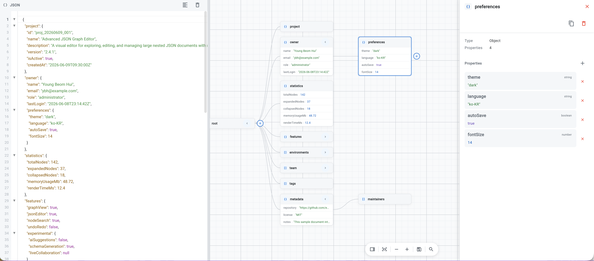

# json_graph_editor

한국어 문서: [README.md](README.md)

A Flutter widget that visualizes and edits JSON as an interactive node graph.



- Left panel: syntax-highlighted JSON editor with line numbers and block folding
- Right panel: interactive node graph with zoom, pan, and fit-to-view
- Tap any node card to inspect, edit, add, and delete properties in the side panel — with type-aware editors per entry
- Multi-tab support via `JsonEditorTabView` + `JsonEditorTabController`
- Light / dark mode toggle — synced across all tabs simultaneously
- Search nodes by label, entry key, or value — auto-expands and highlights matches
- Full style customization via `JsonEditorStyle`
- Extend the toolbar with custom action buttons

---

## Installation

```yaml
dependencies:
  json_graph_editor:
    git:
      url: https://github.com/Yeo-bh/flutter_json_graph_editor.git
```

Or from a local path:

```yaml
dependencies:
  json_graph_editor:
    path: ../json_graph_editor
```

---

## Basic usage

```dart
import 'package:json_graph_editor/json_graph_editor.dart';

class MyPage extends StatelessWidget {
  @override
  Widget build(BuildContext context) {
    return Scaffold(
      body: JsonEditorWidget(),
    );
  }
}
```

Provide initial JSON:

```dart
JsonEditorWidget(
  initialJson: '{"name": "flutter", "version": "3.0"}',
)
```

---

## Reading the JSON value

`JsonEditorWidget` exposes an `EditorState` via Provider. Read it anywhere below the widget:

```dart
import 'package:provider/provider.dart';
import 'package:json_graph_editor/json_graph_editor.dart';

// inside a widget that is a descendant of JsonEditorWidget
final json = context.read<EditorState>().jsonText;
```

---

## Change callback (onChanged)

To receive the JSON value automatically on every edit — without a button — use `onChanged`.

### JsonEditorWidget

```dart
JsonEditorWidget(
  initialJson: '{"name": "flutter"}',
  onChanged: (dynamic json) {
    // json is Map<String, dynamic> or List<dynamic>
    print(json);
  },
)
```

Only fires when the JSON is valid. Triggers on both text editor edits and graph node mutations.

### JsonEditorTabView

Listen to all tabs through `JsonEditorTabController.onChanged`:

```dart
final controller = JsonEditorTabController(
  initialTabs: [
    (name: 'user.json', initialJson: '{"id": 1}'),
    (name: 'config.json', initialJson: '{"debug": true}'),
  ],
  onChanged: (String tabId, dynamic json) {
    print('tab $tabId changed: $json');
  },
);
```

Can also be set after construction:

```dart
controller.onChanged = (tabId, json) { ... };
```

Listeners are registered and removed automatically when tabs are added or removed.

---

## Custom toolbar actions

Add buttons to the graph toolbar via `extraActions`:

```dart
JsonEditorWidget(
  extraActions: [
    GraphToolbarAction(
      icon: Icons.save_outlined,
      tooltip: 'Save',
      onTap: (ctx) {
        final json = ctx.read<EditorState>().jsonText;
        // do something with json
      },
    ),
  ],
)
```

---

## Dark mode

### JsonEditorWidget (standalone)

```dart
JsonEditorWidget(
  initialDarkMode: true,       // start in dark mode
  enableThemeToggle: true,     // show toggle button in toolbar (default)
  style: JsonEditorThemes.light,
  darkStyle: JsonEditorThemes.dark,
)
```

### JsonEditorTabView

The tab view applies one theme to all tabs at once. Toggling in any tab switches every tab and the tab bar.

```dart
JsonEditorTabView(
  controller: _tabController,
  tabBarStyle: const JsonEditorTabBarStyle(),         // light tab bar
  darkTabBarStyle: JsonEditorThemes.darkTabBar,       // dark tab bar (default)
)
```

---

## Styling

Pass a `JsonEditorStyle` to customize every visual aspect:

```dart
JsonEditorWidget(
  style: JsonEditorStyle(
    graphPanel: GraphPanelStyle(
      backgroundColor: const Color(0xFF1E1E2E),
    ),
    nodeCard: NodeCardStyle(
      backgroundColor: const Color(0xFF313244),
      headerBackgroundColor: const Color(0xFF45475A),
      labelColor: const Color(0xFFCDD6F4),
    ),
    edge: EdgeStyle(
      lineColor: const Color(0xFF89B4FA),
    ),
  ),
)
```

`JsonEditorStyle` bundles all sub-styles in one place:

| Property | Controls |
|---|---|
| `graphPanel` | Canvas background, grid lines |
| `nodeCard` | Node card colors, fonts, borders |
| `nodeDetail` | Side panel property editor |
| `addChildDialog` | Add child node dialog |
| `edge` | Connection line color and width |
| `graphToolbar` | Zoom/action toolbar |
| `editorPanel` | Code editor colors and fonts |
| `splitView` | Divider between the two panels |

Use `copyWith` to override only what you need:

```dart
JsonEditorStyle(
  nodeCard: const NodeCardStyle().copyWith(
    borderColor: Colors.blue,
  ),
)
```

---

## Search

Open the search bar with the 🔍 button in the toolbar. Press Enter or the search button to run.

| Mode | Searches |
|------|----------|
| All (default) | Node label + entry key + entry value |
| Key | Node label only |
| Value | Entry value only |

- Matched nodes get an orange border; matched entry rows get a yellow background
- Ancestor nodes along the path to the match are also highlighted
- The graph auto-expands to reveal matched nodes

---

## Dependencies

- [provider](https://pub.dev/packages/provider)
- [re_editor](https://pub.dev/packages/re_editor)
- [re_highlight](https://pub.dev/packages/re_highlight)
